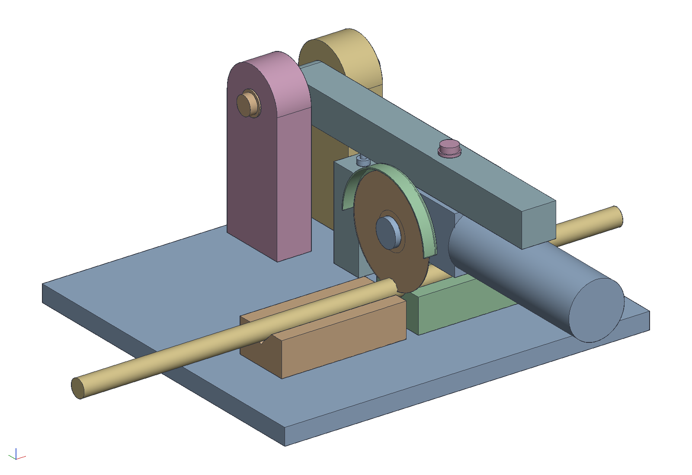
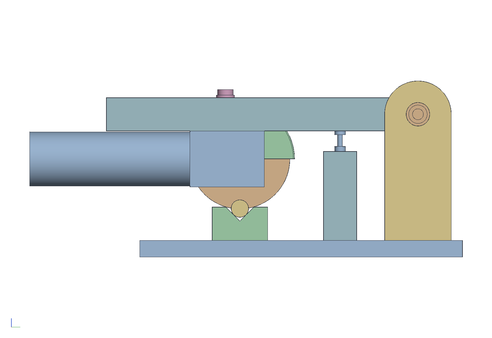
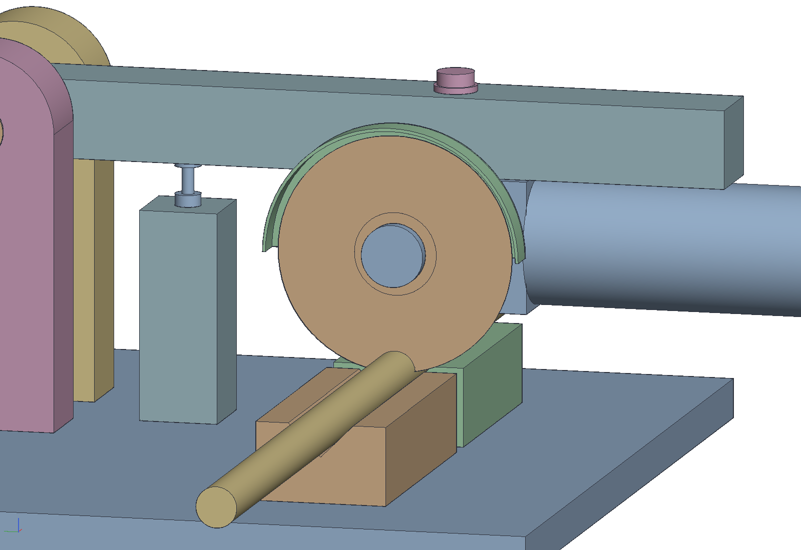
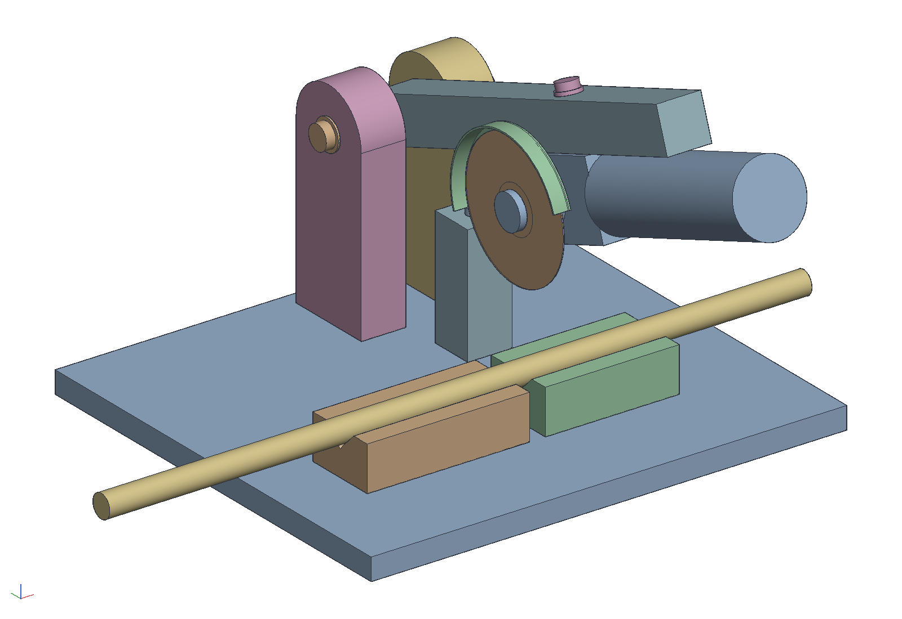
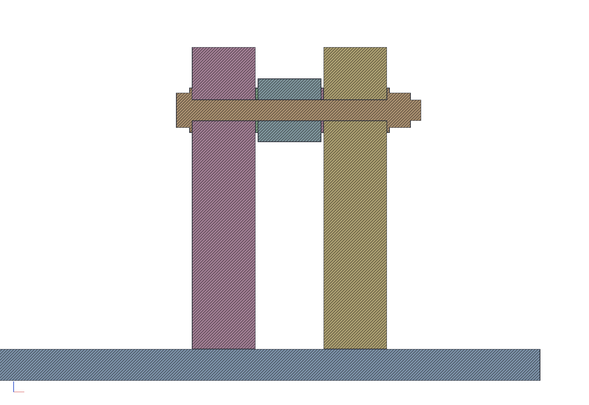

# A mini chop saw from a 4-1/2 in angle grinder

Preliminary. The old orange 4-1/2 in grinder (Chicago Electric /
Central Machinery, 11,000 rpm, 5/8-11 spindle, 2004) on a wooden arm
that swings on a 1/2 in bolt between two laminated birch cheeks. The
whole thing is one plywood base clamped to the bench, with no welding
and no printed parts. Its first job is the duplicator's six cuts in the
20 mm hardened shafts (X 760 x2, Y 700 x2 and Z 250 x2 from four
1000 mm SFC20s). The Bauer and the 7-9 in Hercules come later as their
own mount blocks.

```sh
cargo build --release -p ok-mcp
python3 examples/chop-saw/build.py            # the document, pictures, sheets and parts list
cargo test -p ok-render --test chop_saw       # what CI runs
```



## How it cuts a hardened rod

The shafts are induction hardened: a case about 1-2 mm deep at about
60 HRC over a soft core. A hacksaw will not touch the case; an abrasive
disc will. A 20 mm rod is too much for a 4-1/2 in disc to plunge
through in one go without the gearhead coming down on the work, so
the rod turns instead:

1. The rod lies in two hardwood V-blocks, one each side of the disc
   with a 1/2 in gap between them. It is not clamped.
2. The arm comes down onto the **depth stop**. The stop is set so the
   disc's bottom ends **0.5 mm past the rod's axis** and no further.
3. Hold the head down on the stop with one hand and turn the rod slowly
   with the other, from its long end, well away from the disc. The
   first turn cuts a groove through the hard case all the way round.
   Each turn after that goes deeper, and the offcut drops when the
   groove reaches the centre.
4. Turn the rod against the disc's pull. Try that on scrap first.
5. Chamfer and deburr each end before an SC20UU goes on it. A sharp
   edge damages the blocks' ball tracks.

The disc only ever has to reach the rod's centre, about 10 mm, so the
gearhead stays 14.6 mm above the rod and 22.9 mm above the V-blocks
(the test checks both). The disc never reaches the base, so the base
has no kerf slot.

Point the sparks away from you: turn the grinder so the disc's bottom
runs toward the pivot. That throws the stream back over the base; a
strip of flashing there keeps it from scorching. Keep sawdust off the
base when cutting steel.

## The parts

`out/parts.csv` has the wood and the hardware. In short:

- **Base:** 3/4 birch ply, 16 x 14-1/2. Clamp it to the bench through
  its front corners.
- **Cheeks:** two pairs of 3/4 ply glued to 1-1/2, 3 wide, with a
  half-round top. A snug 1/2 in hole runs through each pair, waxed.
  This is the ramp's lesson: thickness at the bearing is what keeps the
  disc from twisting. The bolt is carried over 4-1/2 in (cheek, arm,
  cheek), with a washer each side of the arm and none of the slop of a
  door hinge.
- **Arm:** two plies glued to 1-1/2 square, 14-3/4 long, round at the
  back. It sits on the gearhead's top side-handle boss, held by one
  M10 x 50 bolt down through it. The boss is threaded through a 10 mm
  wall into the gearcase, so the bolt must stop short of the gears: stack
  washers under its head until it stands 9 mm below the arm's underside
  before it goes in (about 3 mm of washers on a true 1-1/2 arm; "3/4" ply
  is often 18 mm, which wants more). Two hose clamps joined into one loop
  hold the arm to the motor body 130 mm ahead of the spindle, so the
  grinder cannot rock on the bolt.
- **Depth stop:** a 1-1/2 square post, 4 tall, under the arm 3-3/4 to
  5-1/4 behind the spindle. That is past the guard's reach however the
  guard is turned. A 1/4-20 bolt in its top has its head bearing on the
  arm's underside, locked with a jam nut. Turning the bolt sets the
  depth: the disc moves 2.3 times what the bolt does, so a quarter turn
  is about 0.7 mm. Reset it as the disc wears.
- **V-blocks:** hardwood 1-1/2 thick with a 90 degree V 1-1/4 wide. Cut
  them as one block, make the first kerf, then screw them down square to
  it, split at the disc.
- **Return spring:** a screen-door spring or a bungee from the arm's
  front to the base's back edge, enough to lift the head off the work.
  It is not drawn.

| | |
|---|---|
|  |  |
|  |  |

`out/swing.pdf` (and `swing.png`) shows the arm from the side on its
stop and at 5, 10 and 20 degrees up. `out/chop_saw.pdf` is the A3 shop
sheet with a parts list. `out/chop_saw.okpart` is the document: one part
studio per part, the head as a sub-assembly, and a revolute named
`pivot` on the bolt.

## What is measured and what is guessed

Everything about the grinder is a named constant at the top of
`build.py`. Replace a guess there with a reading, rebuild, and the
test says whether it still works.

| | value | from |
|---|---|---|
| disc | 4-1/2 x 0.040 x 7/8 cut-off | label (4-1/2 in, 11,000 rpm, 5/8-11) |
| side-handle boss centre from the disc's inner face | 52 mm | measured, +/- 1 |
| gearhead along the spindle from the disc | 28 to 75 mm | photo, +/- 3 |
| boss thread | M10 x 1.5 | measured: a bolt fitted at the store |
| boss centre ahead of the spindle centre | 16.5 mm | measured: bolt at 35 and spindle at 51.5 on a rule across the flange |
| gearhead half-height about the spindle (boss face to axis) | 32 mm | guess: **measure**, it sets the arm's height and the gearhead's clearance over the rod |
| gearhead nose behind the spindle / ahead to the body | 28 / 57 mm | photo |
| motor body diameter | 62 mm | guess |
| boss wall | 10 mm, threaded through into the gearcase | measured: the bolt does not bottom |

What the numbers give, as the build prints them: the rod's axis sits
55.4 mm above the bench and the spindle 112.1 mm; the pivot is 8 in
behind the spindle and 51 mm above it, so the disc comes down 14 degrees
off vertical at the stop. Raised 20 degrees, the disc is 62 mm above
the rod.

## Findings

- A disc worn to about 85 mm diameter brings the gearhead down onto
  the rod. Change discs before then. The real figure depends on the
  gearhead half-height, which is a guess.
- The disc plunges 14 degrees off vertical at the stop because the arm
  sits on top of the gearhead, above the spindle. That doesn't matter
  for a turned rod. A lower pivot would make it vertical, at the cost of
  a dropped lug on the arm.

## Open

- [ ] Measure the gearhead's height (top boss face to the spindle's
      centre) and put it in `build.py`.
- [ ] An up stop, so the spring cannot throw the head back past the
      cheeks. A cord from the arm to the base is enough.
- [ ] Mount blocks for the Bauer and the Hercules: a block per grinder,
      shimmed so its disc runs in the same plane as the V-blocks' gap.
