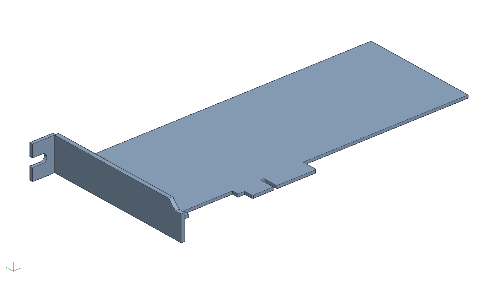

# Dummy PCIe x4 card, low profile

A board-shaped blank to print and plug into a PCI Express slot when
something needs mounting in a slot position and no electronics are
wanted: the outline of a low profile x4 add-in card with its edge
fingers, key notch, PCI-prevention block and bracket holes, 1.57 mm
thick. `out/card.stl` is the card; `out/card_with_bracket.stl` is the
same card with a printable I/O bracket fused to its end, so it screws
down like a real one. `build.py` makes both through the MCP server;
`crates/ok-render/tests/pcie_dummy.rs` checks them.

    cargo build --release -p ok-mcp
    python3 examples/pcie-dummy/build.py
    cargo test -p ok-render --test pcie_dummy

## Where the numbers come from

The PCI Express Card Electromechanical Specification (CEM), revision
2.0, section 6.1, figures 6-7 (low profile card), 6-8 (with its
bracket) and 6-9 (the low profile bracket); figure 6-1 for the standard
height card. Frame: x along the card from the bracket-end face, y up
from the bottom of the edge fingers (the CEM measures card height from
there), z through the thickness from the solder side.

| what | mm | source |
|---|---|---|
| thickness | 1.57 | CEM, 1.57 ref |
| height, finger bottom to top edge | 68.90 | CEM low profile maximum (standard height 111.15) |
| length | 167.65 | CEM MD2 maximum; MD1 is 119.91, and any shorter card mounts the same |
| body bottom edge above the finger bottom | 8.25 | CEM 6-7 |
| bracket-end foot | 15.00 long, bottom at 4.85 | CEM 6-7 |
| key notch centre from the bracket-end face | 57.15 | CEM datum A; 59.05 from the bracket's outer face (6-8) |
| PCI-prevention block beside the fingers | 3.65 wide, down to 4.85 | CEM 6-7 note 2 |
| bracket screw holes | 2 x Ø3.18, 7.25 in from the end, 53.90 apart | CEM 6-7 (standard height: 85.40 apart); printed Ø3.3 |
| x4 edge: tab, pins, key | 34.3 long, 1.0 pitch, key 1.9 wide between pin 11 and pin 12, 0.5 chamfers | KiCad `BUS_PCIexpress_x4` edge, which follows the connector drawings |

The tab runs from 0.65 before pin 1 to 0.65 past pin 32, with pin 12
three pitches after pin 11 across the key; a different width is the
`PINS` constant (x1 18, x8 49, x16 82). The key notch is round-topped
and runs the full 8.25 of the tab. A real card's fingers are bevelled
20 degrees on both faces for insertion; sand a bevel on the printed
tab's bottom edges, or it will be a stiff push.

Two things are read off the figures rather than dimensioned on them
and are good to about half a millimetre: the hole height above the
finger bottom (7.25, from figure 6-1's lower-left detail) and the tab's
start relative to the key (the CEM's 11.65 against KiCad's 12.15; the
KiCad tab is used, since the slot is keyed on the notch and the
connector's end has clearance). Neither matters for a dummy.

## The bracket

Figure 6-9's low profile bracket, simplified to print flat with the
card (solder side down) in one piece:

- The plate is 1.6 thick rather than 0.86 steel, and its width is
  trimmed to the card's solder face (17.56 of the 18.42), since a flat
  print cannot carry the 0.86 ear that reaches beyond the solder side.
  The bracket still fills the chassis slot and the tab still takes the
  screw.
- The top tab (11.84 out from the plate, with a 4.4 slot for the #6-32
  screw, round-ended 6.35 in from the plate) sits 0.5 over the card's
  top edge. The 4.42 return lip and the EMI dimple are left off.
- The 45 degree run-in to the 14.30 bottom tab starts 71.46 below the
  top tab's underside and the tab ends at 79.20, the spec's heights.
  The 5 degree kick in the bottom tab is left off.
- The card's end is fused straight into the plate's inner face. On a
  real card the end stops 1.03 inside the bracket and the ears carry
  it; here the holes are there for a real bracket if one is swapped
  in.

Print the bare card flat. Print the card with bracket flat too, solder
side down: the bracket is a 17.56 mm wall standing on the bed and the
top tab a short overhang off it, which prints without support. Use a
stiff filament (PETG or better) if the slot has to hold weight; the
unsupported 160 mm of 1.57 mm PLA sags under warm case air.
