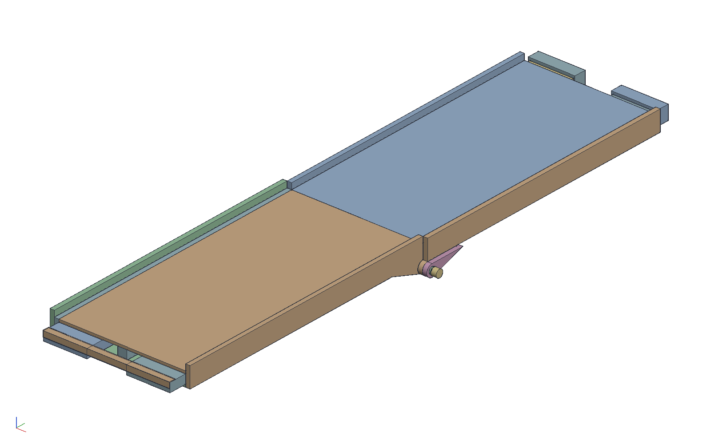
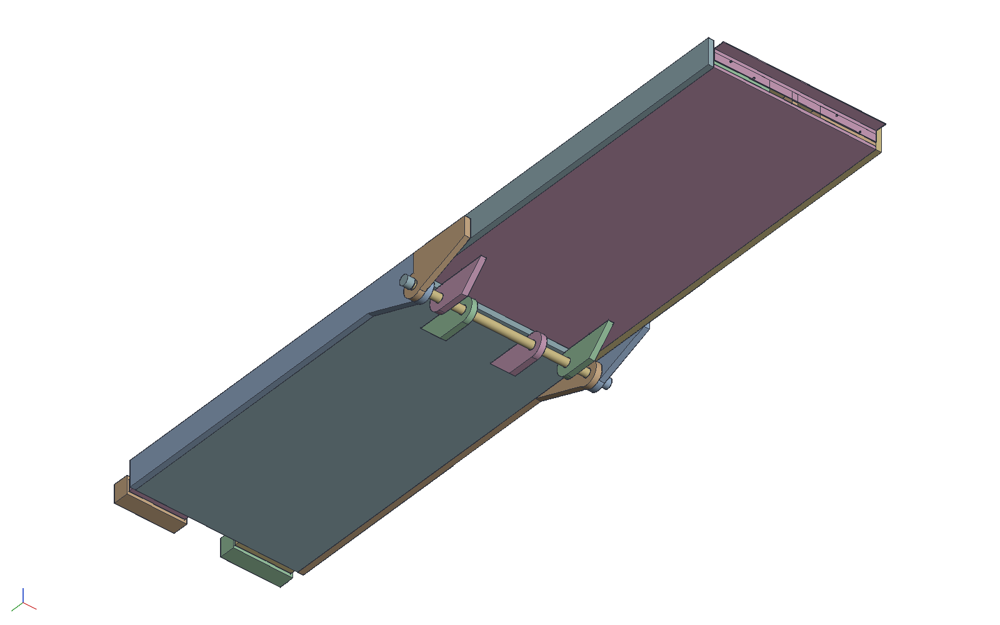

# Folding torsion-box truck ramp

A two-piece folding loading ramp for a Hyundai Santa Cruz, built for a
29 in lawn aerator: two torsion-box panels of 15/32 in CDX skins on
3/4 in birch ribs, 31-7/8 x 48 x 2-3/8 each, hinged on two short pipe
nipples through eight plywood lugs under the joint. It folds
bottom-to-bottom, the nipples pull to separate the halves, and nothing
stands past the sides. `build.py` makes the document through the MCP
server; `crates/ok-render/tests/ramp.rs` checks it.

    cargo build --release -p ok-mcp
    python3 examples/ramp/build.py            # the document, pictures, sheets, cut sheets and cut list
    cargo test -p ok-render --test ramp       # what CI runs

The shop works in inches and the document in millimetres like the
other examples: every dimension is a named constant in inches at the
top of `build.py`, and the helpers convert. Sections 1 to 7 describe
the ramp as it is; section 8 is how it got here.

## 1. What it is

- Replaces two loose 8 ft 2x8 planks with end plates, which work but
  are too long to leave in the bed.
- Two panels, alike but for the free end, each a torsion box: two
  15/32 CDX skins on 3/4 birch ribs on edge, a 2x4 flat across the
  hinge end and 2x8 stubs at the free end. 2-3/8 thick, 31-7/8 wide
  over the box, 48 long. Rails of 3/4 birch outside the box on both
  long sides stand 1 in above the deck as curbs: 33-3/8 over the
  rails.
- Joined by a **pinned hinge under the joint**: four identical lugs
  a panel hang below the bottom skin and interleave with the other
  panel's; two 10 in pipe nipples run through them, one through each
  side's four. The pin centre sits 1-1/2 in below the bottom skin, so
  under load the decks butt in compression and the pins carry the
  tension at the longest lever arm available.
- **Folds bottom-to-bottom** like a drop-leaf table, decks out,
  bottoms 3 in apart with the lugs filling the gap: a package 33-3/8
  x 49-1/2 x 9-3/4.
- Unscrew an outer cap, pull a nipple, and the halves separate: two
  panels of about 45 lb.
- The tailgate end keeps the existing aluminium ramp end plates,
  which clamp a bare 1-1/2 x 7-1/4 board end, so that panel's 2x8
  stubs run 3 in past the skins. The ground end stops flush, bevelled
  30 degrees, with an aluminium angle as the lip.
- Lives under a bed cover or in the garage, painted with sand in the
  top coat for grip. Not a weather-exposed design.

## 2. Stock

`out/cutlist.csv` is the cut list the script writes; this is the
shopping list behind it.

| item | spec | qty | notes |
|------|------|-----|-------|
| skins | 15/32 CDX sheathing, 4x8 (sized 95-7/8 x 47-7/8) | 2 sheets | cut the first in thirds across its length: three 31-7/8 x 47-7/8 blanks; the fourth from the second sheet, which keeps two thirds of itself; trim each to 45; C face up on the top skins |
| rails, lugs, ribs, cross blocks | 3/4 birch plywood, 4x8 | 1 sheet | 22-1/2 in of its 48 (`out/cut_sheet_birch.pdf`) |
| joint blocks | 2x4 flat | 2 x 31-7/8 | across the hinge end between the skins; the lugs bear on it |
| stubs | 2x8 | 2 x 12 (tailgate panel), 2 x 9 (ground panel) | outer rib positions at the free end; the tailgate panel's run 3 in bare past the skins for the end plates, the ground panel's stop flush with the skins |
| hinge pins | 1/2 Sch 40 galvanized precut nipples, 0.840 OD, threaded both ends | 2 x 10 | one through each side's four lugs |
| pipe caps | 1/2 malleable | 4 | the outer pair retain the nipples, flush with the rails' faces; the inner pair sit in the middle gap |
| bushings | 1 Sch 40 galvanized pipe, 1.049 ID x 1.315 OD, cut into 3/4 rings | 8 | one pressed into every lug, flush both faces; the pin runs loose in them |
| ground edge | 1/8 x 1-1/2 aluminium angle | 1 x 31-7/8 | one leg screwed to the ground panel's flush end, the other out past it as the lip; four #10 x 2 pan heads |
| end plates | existing Erickson-type 2x8 ramp end plates | 2 pr | tailgate end only; a ghost in the model |
| adhesive | PL Premium polyurethane | | every rib and block face |
| brads | 18 ga, 1-1/4 and 2 | | the box is glued and brad-nailed throughout and weighted while it cures; the only screws are the angle's |
| finish | exterior latex, sand broadcast into the second top coat | | |

## 3. Panel geometry

Frame of a panel: x across the width (0 to 31-7/8 over the box), y
along the length (0 at the hinge end, 48 at the free end), z up from
the bottom face of the bottom skin. Panel B is the same frame turned
180 degrees about z and moved 31-7/8 in x, so its x runs 31-7/8 to 0
and its y 0 to -48.

- **Width 31-7/8.** A third of a CDX sheet's 95-7/8 with two 1/8
  kerfs, 1-7/16 each side of the 29 in aerator. `W` in the script is
  that third and everything across the width follows it.
- **Box** 31-7/8 x 48 x 2-3/8 (0.4375 + 1.5 + 0.4375).
- **Skins** 31-7/8 x 45 x 15/32, both stopping at y = 45 so the stubs
  run bare from 45 to 48 on the tailgate panel (the ground panel's
  stubs stop at 45 with them). The bottom skin has four 3/4 x 3
  notches at the hinge end where the lugs pass through, and its
  hinge-end bottom edge is chamfered 3/8 since it sweeps a 1-1/2 in
  radius about the pin.
- **Ribs** 3/4 birch strips on edge, 1-1/2 tall, six of them centred
  at 1.5, 8, 13.5, 18-3/8, 23-7/8 and 30-3/8 (symmetric about the
  middle; the second and fifth clear the stubs by 3/8). The four
  inner ribs run from the joint block to the skins' end (41-1/2), the
  two edge ribs stop at the stubs (32-1/2).
- **Cross blocks** of the same strip between the ribs at y = 16 and
  32: 5-3/4, 4-3/4, 4-1/8, 4-3/4, 5-3/4.
- **Joint block** 2x4 flat across the full width at y = 0 to 3-1/2,
  between the skins: what the deck compresses against under load and
  what the lugs bear on.
- **Stubs** 2x8 flat at the outer rib positions (x 0 to 7-1/4 and
  24-5/8 to 31-7/8) from y = 36: 12 long on the tailgate panel, 3 of
  it bare for the end plates; 9 long on the ground panel, flush with
  the skins, with a 30 degree bevel across the whole end so the end
  face stands plumb on the ground.
- **Rails** 3/4 birch on edge outside the box on both long sides, 45
  long and 3-3/8 tall (the 2-3/8 box plus a 1 in curb), plain and
  flush on both panels, ending flat on the joint plane.

## 4. Hinge

The hinge axis is parallel to x at y = 0, the joint plane where the
panels' skins and joint blocks butt, at z = -1-1/2 (`PIN_DROP`).

- **Lugs.** Eight alike, 3/4 birch, 9-1/2 x 4-15/16 with the lug
  profile: a foot 6 in long inside the box against the side of a rib,
  behind the joint block, down through the bottom skin's notch to a
  half-round of 1-1/2 radius (`LUG_R`) about the pin, tapering back up
  to the skin over 8 in. The foot is glued and brad-nailed through its
  face into the rib and from the bottom skin into the foot; the pull
  on a lug bears on the joint block (about 210 psi on 1.1 in²), so
  the fasteners hold it square during glue-up and are the insurance.
- **Where they sit.** On the far (+x) side of the ribs at 1.5, 8,
  23-7/8 and 30-3/8: centred at 2-1/4, 8-3/4, 24-5/8 and 31-1/8, the
  same on both panels. The ribs are symmetric, so panel B turned lands
  its lugs on the near side of the same ribs, and across the hinge
  they run B, A, B, A, B, A, B, A with a rib between each pair, none
  touching, the middle pair 13-5/8 apart, all inside the rails.
- **Bushings.** Every lug bore is 1-5/16 for a ring of 1 in pipe
  (1.049 ID, 1.315 OD) cut 3/4 long and faced square, pressed in
  flush with both faces, so the pin wears on steel rather than the
  ply's end grain and the bearing on the wood is spread over the
  ring's larger diameter. The lugs are bored in place through a jig
  so all eight are coaxial; the rings go in afterwards.
- **Pins.** Two 10 in nipples of 1/2 Sch 40 pipe (0.840 OD), one
  through each side's four lugs (3/8 to 9-1/8 and 22-3/4 to 31-1/2),
  each set 1/8 inside the box edge so its outer cap ends flush with
  the rail's outer face and its inner cap sits in the gap between the
  middle lugs, the inner caps 9-7/8 apart. The pin has about 0.2 of
  play in the rings, accepted: the rings are there for wear, not for
  a fit, and the hinge carries its load through the lugs' faces.
- **Fold.** One revolute between the left nipple and panel B's lug on
  it. The fold goes under: B's free end drops, and at 180 degrees it
  lies under A, bottoms 3 in apart, lugs interleaved. The test finds
  no interference at 0, 5, 10, 20, 45, 90, 135, 170 and 180 degrees.

## 5. Loads

300 lb at mid-span of the open 93 in ramp: M = 7,000 in·lb. With the
pin centre 1-1/2 below the bottom skin the lever arm from pin to the
compression at the top of the deck is 3-7/8, so the pin tension is
about 1,860 lb, 465 lb a lug over four lugs a panel. A single 3/4
birch lug with the 27/32 wall the 1-1/2 radius leaves round the
bushing seat sees about 370 psi in tension and shear-out and 470 psi
of bearing from the ring on its seat, the bearing the governing number
at under half of what birch ply takes. The ribs as shear webs are good
for about the same as a 2x2 of spruce, and the skins carry the
bending.

## 6. The model

- **Parts.** One studio per part, every part built in place in the
  panel's frame. The skins, ribs, cross blocks, joint block, rails,
  lugs and bushings are shared by both panels; only the stubs differ.
  The four lugs are a studio each because a kernel `add` joins every
  body in the studio and each needs a half-round added to its
  profile. The ply bodies carry their names and material (CDX 0.55,
  birch 0.68 g/cm3) so the parts lists read "rib · 1.5 x 32.5". The
  ground stub's bevel is a suppressed feature: on in `out/stub.pdf`,
  off in the ramp.
- **Assemblies.** `panel A` and `panel B` are assemblies of fixed
  instances (a panel is one glued box; a mate per part would say
  nothing); the `ramp` places B turned and moved, the nipples, caps,
  end plates (ghosts on A's bare stubs) and the ground angle on B's
  flush end, with the one revolute, `fold`.
- **Tunables.** `skin`, `rib`, `curb`, `pin_drop` and `lug_r` are
  document variables; the skin and rib extrude depths are bound to
  the first two. The rest live in sketched profiles, which the script
  redraws from the constants at the top.
- **Cut sheets.** Three assemblies lay the real bodies flat on their
  sheets, long way along x: the first CDX sheet cut in thirds, a top
  skin, a bottom skin and a top skin; the second with the other
  bottom skin at one end; the birch in rips along the sheet, the four
  rails end to end in two 3-3/8 rips, the eight lugs in a 5-1/2 rip,
  then six 1-1/2 in strips for the twelve ribs and twenty cross
  blocks packed first-fit by length. Each piece sits a kerf from the
  next; the script checks every piece lies flat on and inside its
  sheet, and the test that no two overlap.
- **Outputs**, all in `out/`: `ramp.okpart`; `ramp_iso`,
  `ramp_front`, `ramp_side`, `ramp_below`, `ramp_angle` (the ground
  angle on B's end), `ramp_folded`, `ramp_folded_side`,
  `panel_a_below` and `panel_b_below` (lugs, notches, stubs),
  `panel_a_cutaway` and `panel_b_cutaway` (from below with the bottom
  skin cut away: the lug feet against their ribs, the joint block,
  the top skin intact), `ramp_lug_section` (through a lug on the pin
  axis), `ramp_hinge_section` (folded to 90 degrees, cut through
  panel B's first lug and fitted to the hinge) with
  `hinge_section.pdf` the same cut as a sheet, hidden lines dashed,
  the cut lug and A's beside it drawn by themselves below it, each
  with its bushing; `cut_sheet_cdx.pdf`, `cut_sheet_cdx_2.pdf` and
  `cut_sheet_birch.pdf`, numbered against a list; `panel_a.pdf` and
  `panel_b.pdf` with a section across the width at mid-length and one
  along the length through a lug; `ramp.pdf` with each panel as one
  item; `stub.pdf`; `fold.pdf` and `fold.png` at 0, 45, 90, 135 and
  180 degrees from the side; `cutlist.csv`.
- **The test** regenerates every part closed and places every
  instance; finds the eight bores and the eight bushings on the
  nipples' axis within a hundredth of a millimetre; checks the lugs
  one ply, alternating B, A across the hinge, none overlapping, each
  against a rib of its own panel, all inside the rails, a 10 in
  nipple through each four with the outer caps at the rails' faces
  and every cap clear of the lugs; sweeps the fold; measures the open
  ramp at 93 long and 33-3/8 over the rails, the folded package the
  same over the rails and 9-3/4 thick with the bottoms 3 in apart and
  the lugs filling the gap; and reads the sheet yield off the parts:
  the four skins a sheet and a third of CDX, the birch, ribs
  included, about 38 % of a sheet.

## 7. Shop sequence

1. Cut the CDX: the first sheet in thirds across its length (31-7/8
   with two kerfs), one third off the second; trim each blank to 45.
   Notch the bottom skins for the lugs, chamfer their hinge-end
   bottom edge 3/8.
2. Rip the birch per `cut_sheet_birch.pdf`: rails, lugs, then the
   1-1/2 strips for the ribs and cross blocks. Cut the lug profile
   on the eight lugs together.
3. Bore the eight lugs 1-5/16 through one jig so the bores agree.
   Cut the 1 in pipe into 3/4 rings, face them square, press one into
   each lug flush both faces (epoxy any that slip).
4. On a flat surface: bottom skin, PL on every rib face, ribs, cross
   blocks, joint block and stubs down, brads through the skin; the
   lugs through their notches, each foot glued and brad-nailed to its
   rib and from the skin; then PL and the top skin. Weight it. 24 h.
5. Glue and brad the rails on, flush both sides, ending flat at the
   joint plane.
6. Dry-fit both panels on the nipples, check the fold. Bevel the
   ground panel's end 30 degrees across the whole end, screw the angle
   to it, fit the end plates to the other.
7. Paint; sand into the second top coat; a third thin coat over it.

## 8. Open questions

- A carrying handle: the pins used to be one pipe whose bare middle
  was the handle, and the nipples leave none. A webbing loop screwed
  to a rail at the balance point, or a hand hole.
- Curb height 1 in. Drop it if the folded package needs to be
  thinner.
- The lug taper (8 in) against a full-length skid that lifts the
  bottom skin off the ground.
- Whether the end plates clamp cleanly with the rail ending 3 in
  short of the tailgate end.
- Rib pitch (5 to 6-1/2 under 15/32 skin), and whether the cross
  blocks at 16 and 32 are enough.

## 9. How it got here

The brief (2026-10-04) was two identical 21 x 48 panels on one 3/4
pipe, lugs laminated to 1-1/2 in the rails and inside, a 3/4 spacer
under one rail so the rail lugs could pass. What changed, and why:

- **Pin drop and lug radius 1-1/2**, not 1: the 7/16 wall a 1 in
  radius leaves is one pin diameter of end distance, and the radius
  cannot exceed the pin drop without the half-round meeting the other
  panel's bottom.
- **Lugs one ply.** With the 1-1/2 radius the wall is enough; the
  doubling was buying back the thin wall the radius already fixed.
- **Ribs from the birch, and brads** (2026-10-05): 3/4 birch strips
  on edge instead of 2x2s, straight and 1-1/2 lb lighter a panel; a
  screw into the edge of 3/4 ply holds poorly, so the box is glued
  and brad-nailed.
- **Ground end flush** (2026-10-06): the ground panel's stubs stop
  with the skins and the angle hangs on that end face, its leg 1-1/2
  so both screw rows clear the top skin.
- **Bushings** (2026-10-08): rings of 1 in pipe in the lug bores and
  a 1/2 in pin, in place of bare ply on a 3/4 pipe.
- **Width 31-7/8** (2026-10-08): the aerator measured 29 in; a third
  of a CDX sheet. Six ribs instead of five.
- **All lugs alike, inside the rails** (2026-10-08): the rail lugs,
  the lug stubs, the cheeks, the spacer and the step at the joint all
  go; four identical lugs a panel on the far side of symmetric ribs
  interleave by themselves.
- **Two 10 in nipples** (2026-10-09): the store's precut nipples come
  24 and 36, and a one-piece pin wanted 33-3/8 threaded both ends.
  Each side's four lugs get their own nipple; the outer caps end
  flush with the rails, and the handle became an open question.
